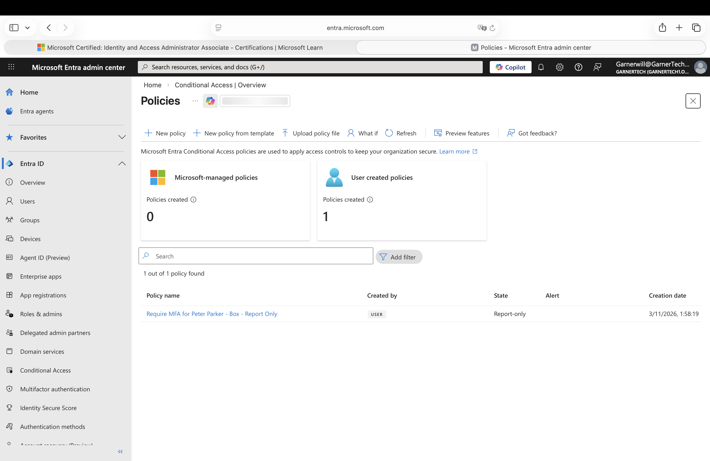
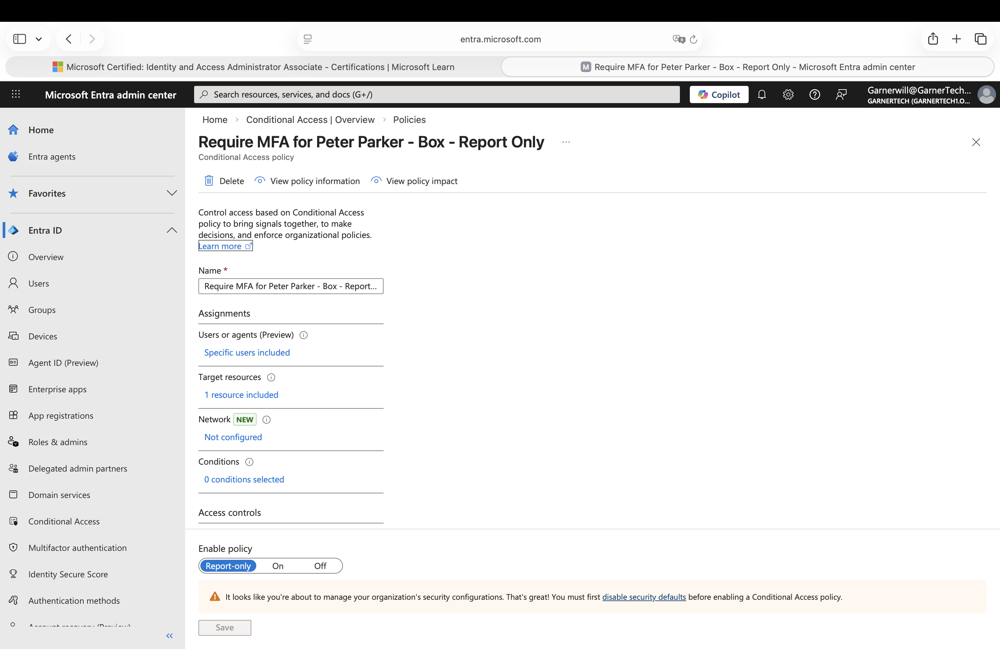
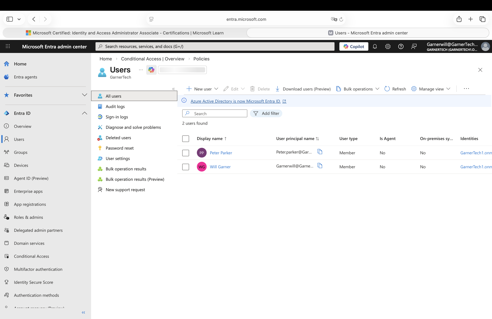

# Microsoft Entra Conditional Access Lab

## Overview
This project is a Microsoft Entra Conditional Access home lab built to practice access policy creation, MFA enforcement logic, and safe policy rollout using report-only mode.

## Objectives
- Create a Conditional Access policy in Microsoft Entra ID
- Target a specific user and cloud application
- Require multifactor authentication as a grant control
- Use report-only mode to safely evaluate policy behavior
- Document the Conditional Access workflow in a home lab

## Lab Environment
- Microsoft Entra ID
- Microsoft Entra admin center
- Microsoft Entra ID P2 trial
- GitHub for documentation

## Policy Scenario
Create a Conditional Access policy that requires MFA for **Peter Parker** when accessing the **Box** enterprise application, using **Report-only** mode for safe testing.

## Tasks Performed
1. Created a new Microsoft Entra tenant with premium trial access
2. Added a test user named **Peter Parker**
3. Added the **Box** enterprise application
4. Opened Conditional Access in Microsoft Entra admin center
5. Created a new Conditional Access policy
6. Targeted **Peter Parker** as the included user
7. Targeted **Box** as the cloud application
8. Configured the grant control **Require multifactor authentication**
9. Set the policy state to **Report-only**
10. Successfully created the policy

## Results
- Successfully created a Conditional Access policy in Microsoft Entra
- Scoped the policy to a specific user and enterprise application
- Configured MFA as the required access control
- Used report-only mode to build the policy safely without immediate enforcement
- Practiced a real-world Conditional Access workflow commonly used in IAM environments

## Skills Demonstrated
- Microsoft Entra ID
- Conditional Access
- Multi-Factor Authentication (MFA)
- Access policy administration
- Identity and Access Management (IAM)
- Security policy testing
- Least privilege
- Safe rollout practices

## Screenshots

### 1. Conditional Access Policies

### 2. Policy in Report-Only Mode

### 3. Peter Parker Test User

## What I Learned
This lab helped me understand how Conditional Access policies are built and scoped in Microsoft Entra ID. I learned how to target a specific user and cloud application, require MFA as a grant control, and use report-only mode to safely evaluate policy behavior before enforcement.

## Resume Bullet
Created a Microsoft Entra Conditional Access policy in a home lab by targeting a specific user and enterprise application, requiring MFA as a grant control, and using report-only mode to safely test policy behavior before enforcement.
